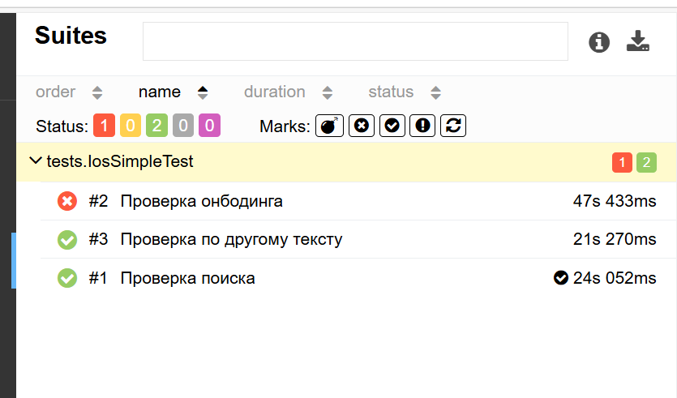
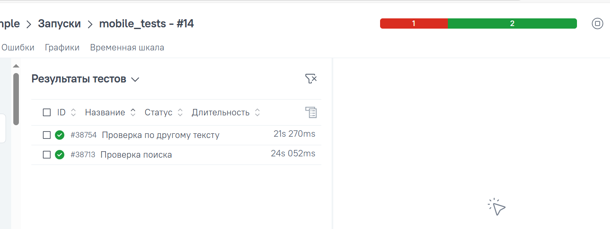
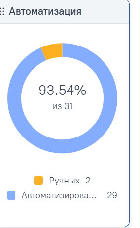
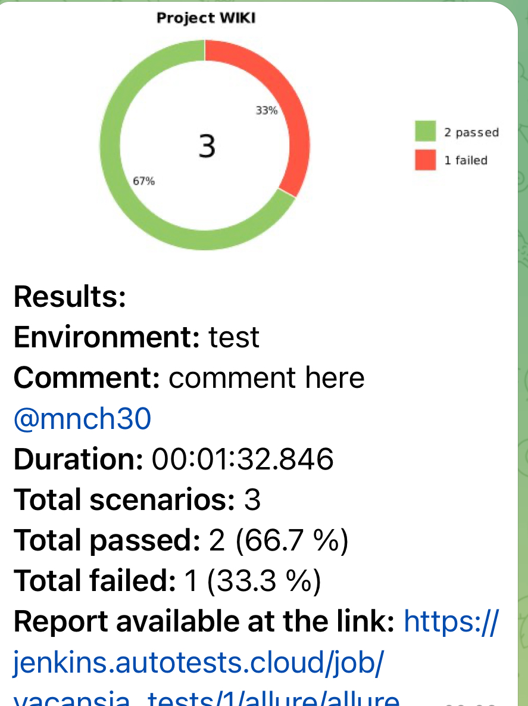

# Проект по автоматизации mobile тестов для приложения [Wikipedia](https://ru.wikipedia.org/)
<p align="center"><a href="https://ru.wikipedia.org/"></a></p>  

> Википедия - общедоступная многоязычная универсальная интернет-энциклопедия со свободным контентом, реализованная на принципах вики.

# 🧾 Содержание:

- <a href="#tools">Технологии и инструменты</a>
- <a href="#checking">Тестовые сценарии, реализованные в автоматизированных тест-кейсах</a>
- <a href="#console">Запуск тестов (Из терминала)</a>
- <a href="#allureReport">Allure-отчет</a>
- <a href="#allure">Интеграция с Allure TestOps</a>
- <a href="#teleg"> Уведомление в Telegram о результатах выполнения автоматизированных тестов</a>
- <a href="#movie">Видеопример прохождения тестов Browserstack</a>


<a id="tools"></a>

## 🔨 Технологии и инструменты:
<p>
  <a href="https://www.jetbrains.com/idea/"></a>
  <a href="https://github.com/"></a>
  <a href="https://www.java.com/"></a>
  <a href="https://gradle.org/"></a>
  <a href="https://junit.org/junit5/"></a>
  <a href="https://selenide.org/"></a>
  <a href="https://aerokube.com/selenoid/"></a>
  <a href="https://www.browserstack.com/"></a>
  <a href="https://developer.android.com/studio"></a>
  <a href="https://www.jenkins.io/"></a>
  <a href="https://github.com/allure-framework/"></a>
  <a href="https://qameta.io/"></a>
  <a href="https://telegram.org/"></a>
</p>

---

## :clipboard: Тестовые сценарии

### Для локального запуска
- :white_check_mark: Проверка стартовых страниц при запуске приложения
- :white_check_mark: Проверка функции поиска в Википедии

### Для удаленного запуска
- :white_check_mark: Проверка стартовых страниц при запуске приложения
- :white_check_mark: Проверка функции поиска в Википедии
---

- Тесты в данном проекте написаны на языке <code>Java</code> с использованием фреймворка для тестирования [Selenide](https://selenide.org/)
- Сборщик - <code>Gradle</code>.
- <code>JUnit 5</code> задействован в качестве фреймворка модульного тестирования.
- При прогоне тестов для запуска используется [Android Studio](https://developer.android.com/), [Browserstack](https://www.browserstack.com/), драйвер Appium.

---

<a id="jenkins"></a>
##  Сборка в [Jenkins](https://jenkins.autotests.cloud/job/021-Melnikov-Wikipedia_mobile_autotests/)

<p align="center">

</p>

---

<a id="console"></a>
## :rocket: Команды для запуска

### Локальный запуск (через эмулятор)

```bash
gradle clean android_local_test
```

### Удаленный запуск (через browserstack)

```bash
gradle clean andoid_browserstack_test clean ios_browserstack_test
```

---

<a id="allure"></a>
##  </a>Интеграция с <a target="_blank" href="https://allure.autotests.cloud/project/3844/dashboards">Allure TestOps</a>

## 🖨️ Основная страница отчёта

<p align="center">  
  
</p>

##  Добавление ручных тестов

<p align="center">  
  
</p>

---

<a id="teleg"></a>
##  Уведомления в Telegram чат с ботом

### Уведомление через чат бот

<p align="center">

</p>


#### Содержание уведомления в Telegram

- :heavy_check_mark: Окружение
- :heavy_check_mark: Комментарий
- :heavy_check_mark: Длительность прохождения тестов
- :heavy_check_mark: Общее количество сценариев
- :heavy_check_mark: Процент прохождения тестов
- :heavy_check_mark: Ссылка на Allure отчет

---

<a id="movie"></a>
## </a> Видеопример выполнения теста c Browserstack


<p align="center">
   
</p>